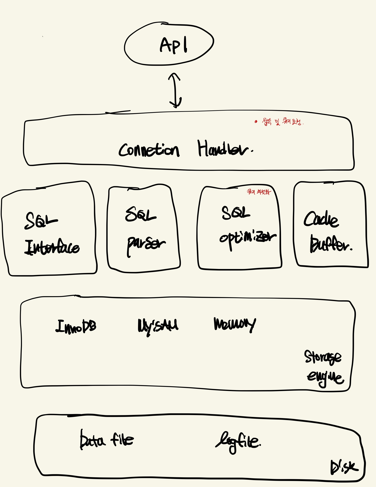
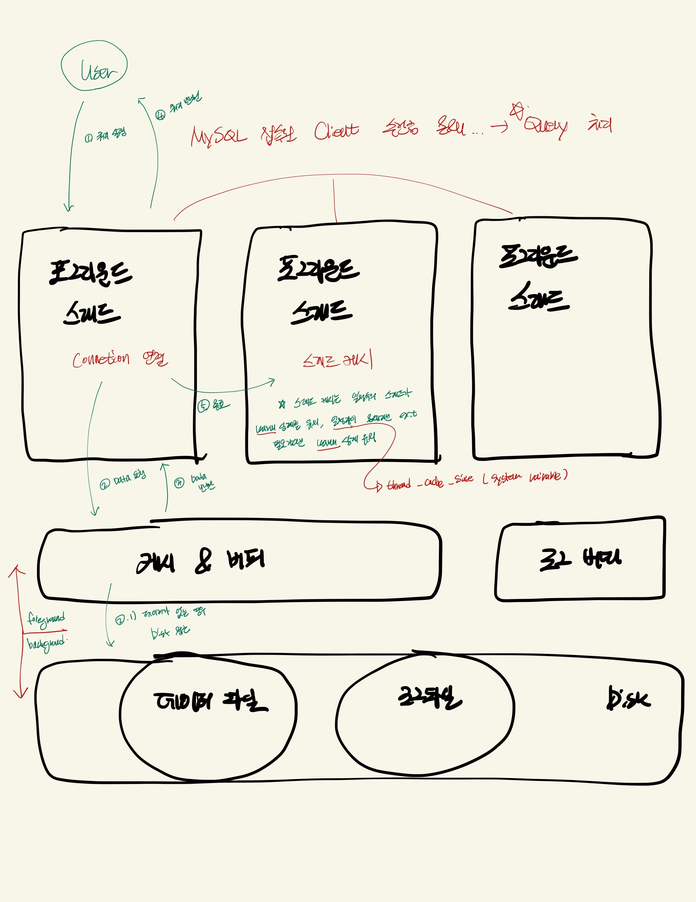
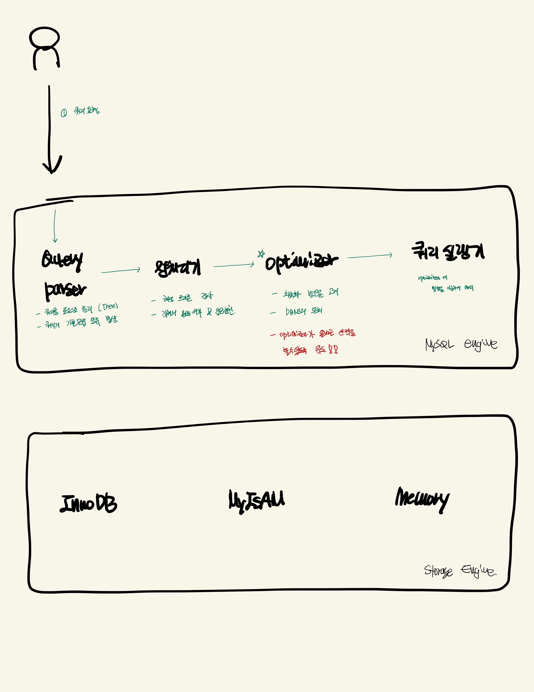

# 아키텍처

## Handler

- Database에서의 Handler라는 용어는 쓰기나 읽기 같은 명령을 Handler라고 한다.
- 해당 명령어를 통해 어떤 Handler 명령어를 많이 사용했는지 알 수 있다.

```sql
    show global status like 'Handler%'
```

## DB

</img>

## Thread

</img>

## Engine

</img>
